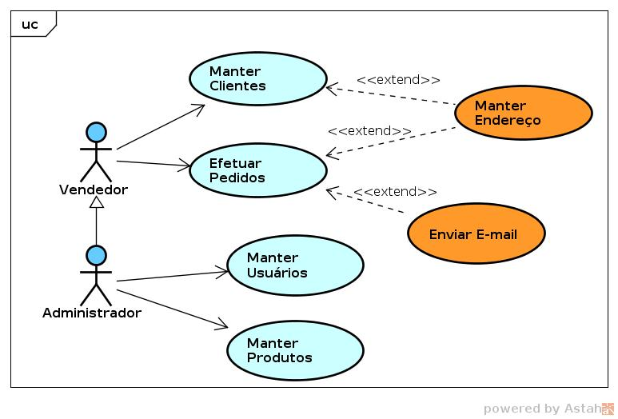
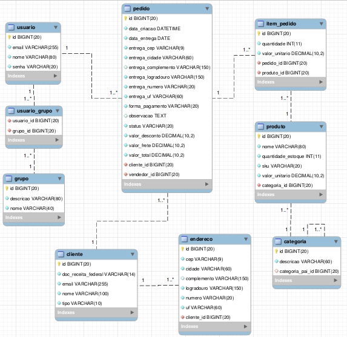
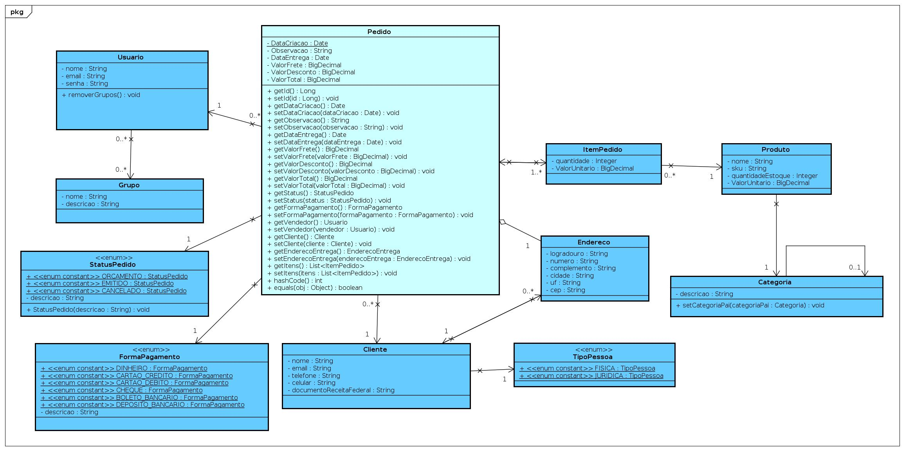
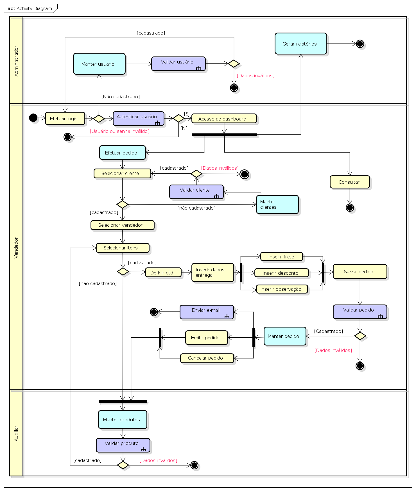
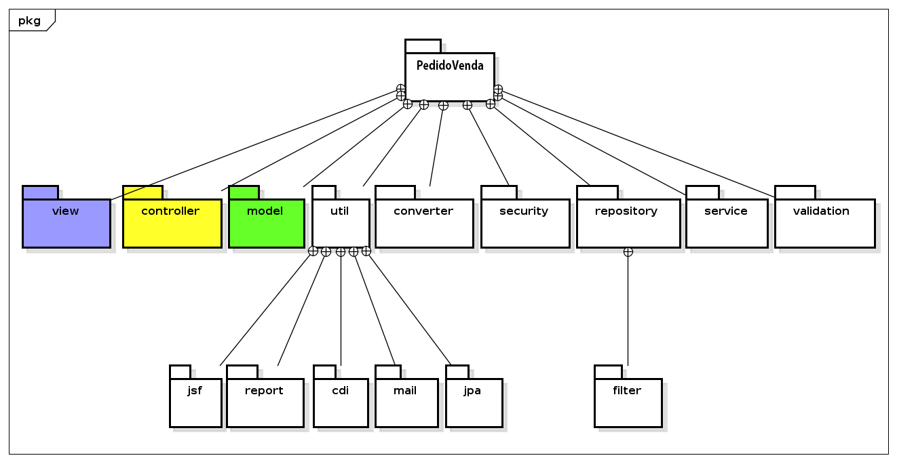

# Pedido de Venda

## Resumo

O sistema desenvolvido para resolver o problema de muitas empresas que utilizam planilhas, para dados cadastrais de clientes e produtos, terá formulários bem detalhados de fácil entendimento, esses formulários foram criados para usuários leigos, que ainda não são acostumados com a tecnologia. 

A empresa utilizando este sistema, ganhará mais tempo em outros detalhes, pois o atendimento ao cliente e o controle dos produtos ficará sendo controlado pelo sistema e não por papeis e programas que não são adequados de forma correta para a utilização dentro da empresa.

## Lista de Tabelas

1. Usuário
2. Produto
3. Cliente
4. Pedido

## Recursos de Software

1. Java EE
2. Facelets
3. JSF e Maneged Bean
4. CDI e Implementação Weld
5. Apache Tomcat
6. Apache Maven
7. Primefaces
8. JPA 2 e Hibernate
9. Bean Validation e Hibernate Validator
10. JavaMail
11. Spring Security

## Diagrama Caso de Uso

## Diagrama de Entidade-Relacionamento

## Diagrama de Classe

## Diagramade Atividade

## Diagrama de Componentes

